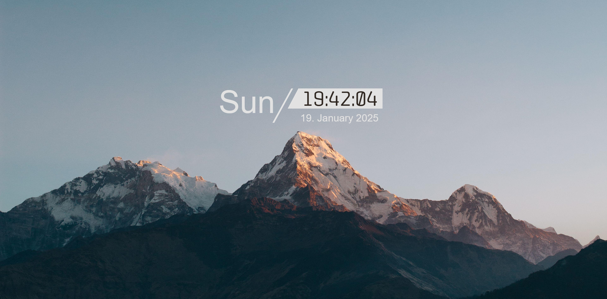

# HTML Wallpaper with mountains and clock
Minimalist HTML wallpaper with clock, date and day.
Suitable for 16:9; 16:10; Ultra-Wide. Could probably work on 4:3 or phones, but not sure.

> [!TIP] 
> ### 3 languages available: Czech, English and German
> To change the language do this:
> 1. Open index.html
> 2. Go to line `110`
> 3. Change to `cs`; `en` or `de` (as shown on line `109`)
> 4. Save and reload!
